<div align="center">



# Reproducibility Engineering — Course Knowledge Base

**Lecture material, readings, lab sheets, module-by-module exam guides, and one compact revision PDF.**


[**📘 Open the combined study-only PDF**](./output/pdf/reproducibility_engineering_study_guide_modules_1-11.pdf) · [Browse the modules](#module-map) · [See the repository map](#repository-map)

</div>

> [!IMPORTANT]
> The **combined 28-page PDF** is the fastest exam-revision route. It contains the study concepts from Modules 1–11 while excluding reference sections, citation links, exercises, answer keys, self-tests, and direct lab procedures. The original module guides and course files remain unchanged.

## Start here

| I want to… | Go here |
|---|---|
| Revise the whole course efficiently | [Combined study-only PDF](./output/pdf/reproducibility_engineering_study_guide_modules_1-11.pdf) |
| Study one specific topic | [Module map](#module-map) |
| Read a searchable module guide | Open that module's `MODULE_*_EXAM_GUIDE.md` |
| Review the original in-class material and readings | Open the topic-material folder inside the relevant module |
| Work through one lab | Open that module's `Lab_Session_*/Sheet_*.pdf` |
| Browse every lab in one place | [Consolidated lab archive](./Exercises_5972UE_Reproducibility_Engineering_%C3%9Cbung/) |
| Check setup and server requirements | [Lab preliminaries](./Exercises_5972UE_Reproducibility_Engineering_%C3%9Cbung/Preliminaries/) |

## Learning path


## Module map

| Module | What you study | Exam guide | Course material | Lab |
|---:|---|---|---|---|
| **1** | Reproducibility crisis; repeatability, reproducibility, and replicability; ACM badges; Docker basics; exact vs statistical comparison | [Guide](./Mod1/MODULE_1_EXAM_GUIDE.md) | [Materials](./Mod1/1-Repeat-Reproduce-Replicate/) | [Sheet 1](./Mod1/Lab_Session_1/Sheet_1.pdf) |
| **2** | Reproducibility levels, workflow provenance, VisTrails, Bronze/Silver/Gold standards, deterministic randomness, and packaging | [Guide](./MOd2/MODULE_2_EXAM_GUIDE.md) | [Materials](./MOd2/2-Levels_of_reproducibility_and_provenance/) | [Sheet 2](./MOd2/Lab_Session_2/Sheet_2.pdf) |
| **3** | Strong hypotheses, research questions, evidence, measurement, experimental reporting, equivalence, and fair comparisons | [Guide](./Mod3/MODULE_3_EXAM_GUIDE.md) | [Materials](./Mod3/3-Hypotheses/) | [Sheet 3](./Mod3/Lab_Session_3/Sheet_3.pdf) |
| **4** | Git state and history, diffs, atomic commits, DCO sign-off, branching, merging, rebasing, patches, and automated reporting | [Guide](./Mod4/MODULE_4_EXAM_GUIDE.md) | [Materials](./Mod4/4-Version_Control/) | [Sheet 4](./Mod4/Lab_Session_4/Sheet_4.pdf) |
| **5** | Reproducible C builds, compilation stages, headers and objects, Make dependencies, preprocessor macros, and `assert`/`NDEBUG` | [Guide](./Mod5/MODULE_5_EXAM_GUIDE.md) | [Materials](./Mod5/5-Reproducible_Builds/) | [Sheet 5](./Mod5/Lab_Session_5/Sheet_5.pdf) |
| **6** | SQLite vs PostgreSQL, Compose, deterministic SQL, FDWs, replication, binary identity, ReproTest, and out-of-tree builds | [Guide](./Mod6/MODULE_6_EXAM_GUIDE.md) | [Materials](./Mod6/6-DBMS-Architectures/) | [Sheet 6](./Mod6/Lab_Session_6/Sheet_6.pdf) |
| **7** | Tidy-data structure, messy-data patterns, SQL reshaping, odds calculations, metadata, provenance, and reproducible benchmarks | [Guide](./Mod7/MODULE_7_EXAM_GUIDE.md) | [Materials](./Mod7/7-Tidy_Data/) | [Sheet 7](./Mod7/Lab_Session_7/Sheet_7.pdf) |
| **8** | Relational/XML/JSON comparison, JSON Schema, HDF5 and `h5py`, Visitor traversal, and DuckDB transformations | [Guide](./Mod8/MODULE_8_EXAM_GUIDE.md) | [Materials](./Mod8/8-Hierarchical_Dataformats/) | [Sheet 8](./Mod8/Lab_Session_8/Sheet_8.pdf) |
| **9** | Local vs remote LLM reproducibility, sampling, prompts and reasoning, validation, JSON Schema, Bowtie, and structured output | [Guide](./Mod9/MODULE_9_EXAM_GUIDE.md) | [Materials](./Mod9/9_-_LLMs/) | [Sheet 9](./Mod9/Lab_Session_9/Sheet_9.pdf) |
| **10** | Controlled build/deploy/run/analyze workflows, durable reproduction packages, SQPolite, secrets, and structured LLM output | [Guide](./Mod10/MODULE_10_EXAM_GUIDE.md) | [Materials](./Mod10/10_-_Remoteness/) | [Sheet 10](./Mod10/Lab_Session_10/Sheet_10.pdf) |
| **11** | FAIR stewardship, GDPR, copyright, trade secrets, EU database rights, multistage containers, remote provenance, and HDF5 | [Guide](./Mod11/MODULE_11_EXAM_GUIDE.md) | [Materials](./Mod11/11_-_FAIRness_and_Legal_Aspects/) | [Sheet 11](./Mod11/Lab_Session_11/Sheet_11.pdf) |

> [!NOTE]
> Module 2 is stored in Git as `MOd2/` with a capital **O**. The links above intentionally use that repository casing so they also work on GitHub's case-sensitive paths.

## Repository map

```text
REP_ENG_MDS/
├── Mod1/ … Mod11/                 # One directory per course module
│   ├── MODULE_*_EXAM_GUIDE.md     # Searchable, detailed study guide
│   ├── <topic-materials>/         # In-class PDF, assigned excerpts, and .url pointers
│   └── Lab_Session_*/             # Module-specific lab sheet
│
├── Exercises_…_Übung/             # Consolidated archive of Labs 1–11
│   ├── Preliminaries/             # Requirements and Docker/server setup
│   ├── Lab_Session_1/ … 11/       # All lab sheets in one location
│   └── RepEng-Labs-Kickoff.pdf    # Lab-course kickoff material
│
├── output/pdf/                    # Final, reader-facing generated PDFs
│   └── reproducibility_engineering_study_guide_modules_1-11.pdf
│
├── assets/                        # README visual assets
├── tmp/                           # Internal extraction/render/audit working files
└── README.md                      # You are here
```

The common module pattern is deliberately predictable:

```text
ModN/
├── MODULE_N_EXAM_GUIDE.md
├── N-Topic_Name/
│   ├── SoSe_2026_RepEng_IC_N_*.pdf
│   ├── assigned_excerpt.pdf
│   └── external_reading.url
└── Lab_Session_N/
    └── Sheet_N.pdf
```

Some modules contain extra resources where the topic needs them—for example the Module 10 SQLite walkthrough and the Module 11 HDF5 cheatsheet.

## What each file type means

| Pattern | Purpose |
|---|---|
| `MODULE_*_EXAM_GUIDE.md` | Detailed, searchable revision guide for one module |
| `SoSe_2026_RepEng_IC_*.pdf` | Original in-class/course material |
| `Lab_Session_*/Sheet_*.pdf` | Hands-on lab sheet for that module |
| `*.pdf` inside a topic folder | Assigned article, book excerpt, walkthrough, or supporting reference |
| `*.url` | Shortcut to an external article, documentation page, or project; some targets may require institutional access |
| `output/pdf/*.pdf` | Final generated deliverable intended for direct reading or download |
| `tmp/` | Internal working material; normally not the place to begin studying |

## Recommended study workflows

<details open>
<summary><strong>⚡ Fast exam revision</strong></summary>

1. Read the [combined study-only PDF](./output/pdf/reproducibility_engineering_study_guide_modules_1-11.pdf).
2. Mark weak modules while reading.
3. Jump to the corresponding Markdown guide in the [module map](#module-map).
4. Use the original course material only when you need more context.

</details>

<details>
<summary><strong>🔬 Deep topic study</strong></summary>

1. Start with `MODULE_*_EXAM_GUIDE.md` for the conceptual map.
2. Read the module's in-class PDF and supporting excerpts.
3. Follow the `.url` shortcuts for primary documentation or external readings.
4. Summarize the concept in your own words before moving to the lab.

</details>

<details>
<summary><strong>🧪 Hands-on practice</strong></summary>

1. Check the [preliminary requirements](./Exercises_5972UE_Reproducibility_Engineering_%C3%9Cbung/Preliminaries/).
2. Open the relevant `Lab_Session_N/Sheet_N.pdf`.
3. Keep the matching module guide nearby for the underlying concepts.
4. Use the [consolidated lab archive](./Exercises_5972UE_Reproducibility_Engineering_%C3%9Cbung/) when working through labs sequentially.

</details>

## Clone and use locally

```bash
git clone https://github.com/ENZOMOTIVE/REP_ENG_MDS.git
cd REP_ENG_MDS
```

Markdown guides render directly on GitHub. Download or clone the repository for the smoothest experience with the PDFs and `.url` shortcuts.

---

<div align="center">

**Capture the data · Pin the environment · Automate the run · Verify the result · Preserve the evidence**

</div>
